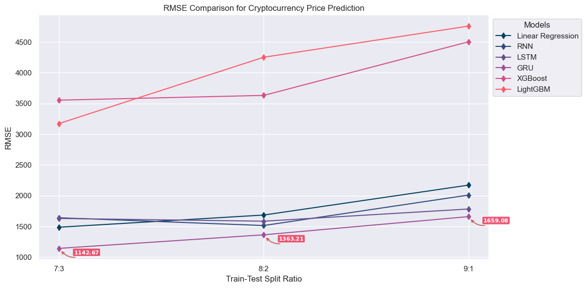
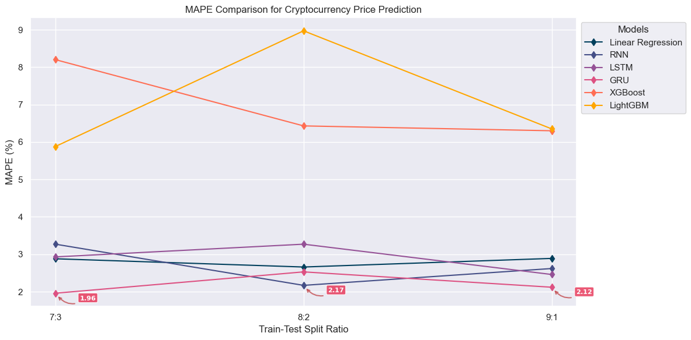
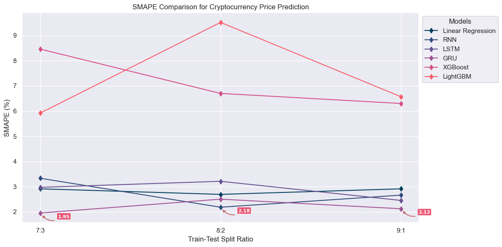
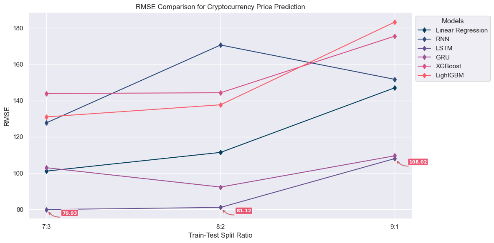
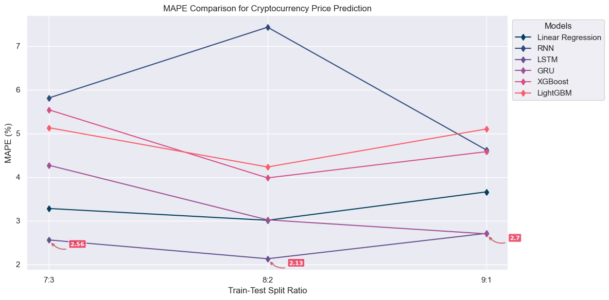
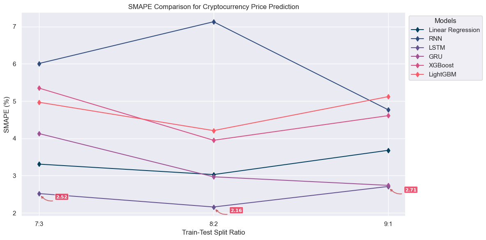
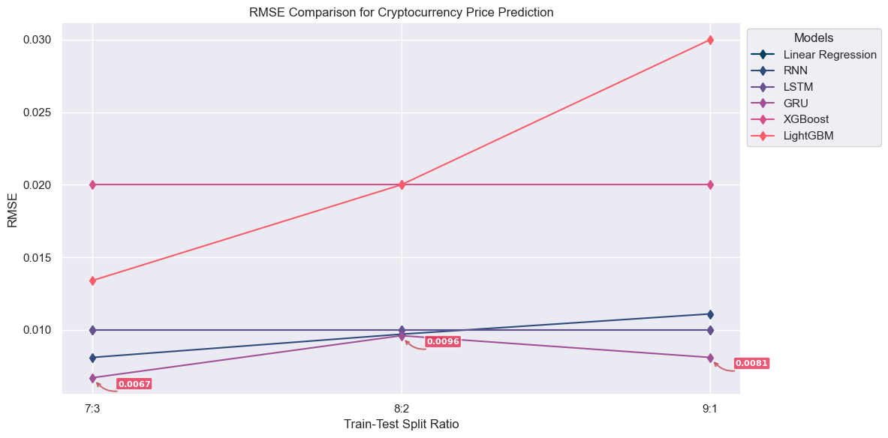
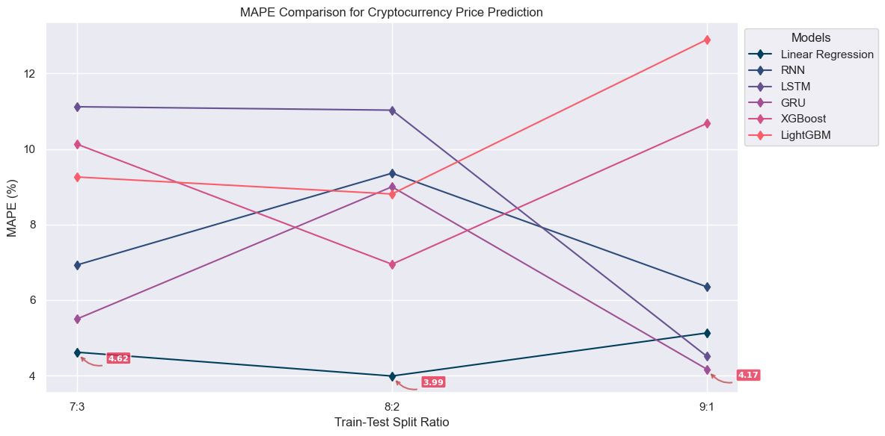
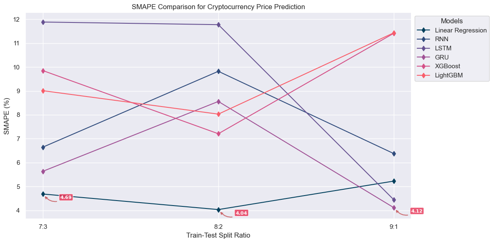

# Comparative Analysis of Statistical and Machine Learning Models for Enhanced Cryptocurrency Price Prediction with Technical Indicator Integration

## 📑 Table of Contents
1. [Introduction](#introduction)
2. [Dataset](#dataset)
3. [Feature Engineering](#feature-engineering)
4. [Models](#models)
5. [Evaluation](#evaluation)
6. [Executive Summary](#executive-summary)
7. [Project Structure](#project-structure)
8. [Installation](#installation)
9. [Usage](#usage)
10. [Contributing](#contributing)
11. [Acknowledgments](#acknowledgments)

## Introduction
This repository contains the code and resources for a class project on forecasting cryptocurrency prices using statistical models and machine learning algorithms. The project explores the performance of Linear Regression, ARIMAX, Recurrent Neural Networks (RNN), Gated Recurrent Units (GRU), Long Short-Term Memory (LSTM) networks, Vector Autoregression (VAR), XGBoost, and LightGBM in forecasting the prices of Bitcoin, Ethereum, and Dogecoin.

## Dataset
The dataset used in this project is collected from finance.yahoo.com, containing daily data for Bitcoin, Ethereum, and Dogecoin from 2018-03-01 to 2024-06-01. The dataset includes features such as open price, high price, low price, close price, adjusted close price, and trading volume.

## Feature Engineering
To improve the predictive performance of the models, the project incorporates technical indicators as features. These indicators, such as moving averages and momentum indicators, provide insights into market sentiment and trends, aiding in the prediction of price movements.

## Models
The following models are implemented and evaluated in this project:

- [Linear Regression](./Models/LinearRegression/)
- [ARIMAX](./Models/ARIMAX/)
- [Vector Autoregression (VAR)](./Models/VAR/)
- [Recurrent Neural Networks (RNN)](./Models/RNN/)
- [Gated Recurrent Units (GRU)](./Models/GRU/)
- [Long Short-Term Memory (LSTM)](./Models/LSTM/)
- [XGBoost](./Models/XGBoost/)
- [LightGBM](./Models/LightGBM/)

## Evaluation
The models are evaluated using various performance metrics, such as Root Mean Squared Error (RMSE), Mean Absolute Percent Error (MAPE), and Symmetric Mean Absolute Percentage Error (SMAPE). Three different train-test split ratios are used for each model: 70:30, 80:20, and 90:10. The results are compared to assess the strengths and weaknesses of each model in accurately predicting cryptocurrency prices.

## Executive Summary
This project explores cryptocurrency price prediction using statistical and machine learning models, focusing on Bitcoin (BTC), Ethereum (ETH), and Dogecoin (DOGE). A dataset from 2018–2024 was analyzed, incorporating technical indicators like MACD, Moving Averages, and Bollinger Bands.

Eight models—Linear Regression, ARIMAX, VAR, RNN, GRU, LSTM, XGBoost, and LightGBM—were evaluated. GRU achieved the lowest RMSE (1,143 for BTC, 0.0067 for DOGE) and MAPE (1.96% for BTC, 5.50% for DOGE) in most scenarios. LSTM excelled in ETH prediction, with an RMSE of 79.93 and MAPE of 2.56%.

These results indicate GRU and LSTM's superior capability to capture complex patterns in cryptocurrency prices. Future work will focus on hybrid models and additional technical indicators to further improve prediction accuracy and robustness.


Below are the detailed results of the models for detail visualization of each model's performance, please refer to this [directory](./Latex/visualize/) for more details.

- **BTC Dataset:**
> Based on the result table below, we can see that the GRU model is the best-performing model among the 8 implemented models in predicting BTC stock prices with a 7:3 ratio, as it has the lowest RMSE, MAPE, and SMAPE values.





| Model | Ratio | RMSE | MAPE | SMAPE |
|----------------------|-----------|----------|----------|-----------|
| Linear Regression | 7:3 | 1,486.62 | 2.88 | 2.91 |
| | **8:2** | **1,684.85** | **2.66** | **2.69** |
| | 9:1 | 2,171.14 | 2.89 | 2.91 |
| ARIMAX | 7:3 | 16,983.58 | 29.76 | 37.00 |
| | **8:2** | **11,725.95** | **16.94** | **18.74** |
| | 9:1 | 15,950.28 | 21.44 | 25.09 |
| VAR | 7:3 | 20,608.81 | 34.19 | 44.80 |
| | **8:2** | **1,438.54** | **22.80** | **24.58** |
| | 9:1 | 18,135.05 | 23.62 | 28.40 |
| RNN | 7:3 | 1,640.65 | 3.27 | 3.33 |
| | **8:2** | **1,514.22** | **2.17** | **2.18** |
| | 9:1 | 2,009.36 | 2.62 | 2.66 |
| LSTM | 7:3 | 1,629.24 | 2.93 | 2.97 |
| | 8:2 | 1,584.69 | 3.27 | 3.21 |
| | **9:1** | **1,782.90** | **2.46** | **2.45** |
| GRU | **7:3** | **1,142.67** | **1.96** | **1.95** |
| | 8:2 | 1,363.21 | 2.53 | 2.50 |
| | 9:1 | 1,659.08 | 2.12 | 2.12 |
| XGBoost | 7:3 | 3,553.40 | 8.20 | 8.46 |
| | 8:2 | 3,630.37 | 6.43 | 6.70 |
| | **9:1** | **4,502.40** | **6.30** | **6.30** |
| LightGBM | **7:3** | **3,172.67** | **5.88** | **5.92** |
| | 8:2 | 4,251.13 | 8.97 | 9.52 |
| | 9:1 | 4,757.29 | 6.35 | 6.57 |

- **ETH Dataset:**
> Based on the result table below, we can see that the LSTM model is the best-performing model among the 8 implemented models in predicting ETH stock prices with a 8:2 ratio, as it has the lowest RMSE, MAPE, and SMAPE values.






| Model | Ratio | RMSE | MAPE | SMAPE |
|----------------------|-----------|----------|----------|-----------|
| Linear Regression | 7:3 | 101.12 | 3.28 | 3.31 |
| | **8:2** | **111.42** | **3.01** | **3.03** |
| | 9:1 | 147.02 | 3.66 | 3.68 |
| ARIMAX | 7:3 | 680.62 | 21.78 | 25.41 |
| | **8:2** | **475.30** | **14.22** | **14.69** |
| | 9:1 | 745.42 | 20.44 | 23.37 |
| VAR | 7:3 | 729.78 | 19.41 | 22.73 |
| | **8:2** | **575.95** | **19.87** | **19.47** |
| | 9:1 | 1,047.97 | 28.03 | 34.15 |
| RNN | 7:3 | 127.70 | 5.81 | 6.01 |
| | 8:2 | 170.59 | 7.43 | 7.13 |
| | **9:1** | **151.67** | **4.62** | **4.77** |
| LSTM | 7:3 | 79.93 | 2.56 | 2.52 |
| | **8:2** | **81.12** | **2.13** | **2.16** |
| | 9:1 | 108.02 | 2.71 | 2.71 |
| GRU | 7:3 | 102.98 | 4.27 | 4.13 |
| | **8:2** | **92.33** | **3.02** | **2.97** |
| | 9:1 | 109.55 | 2.70 | 2.74 |
| XGBoost | 7:3 | 143.88 | 5.54 | 5.35 |
| | **8:2** | **144.28** | **3.98** | **3.95** |
| | 9:1 | 175.47 | 4.58 | 4.61 |
| LightGBM | 7:3 | 130.99 | 5.13 | 4.97 |
| | **8:2** | **137.65** | **4.23** | **4.21** |
| | 9:1 | 183.24 | 5.10 | 5.12 |

- **DOGE Dataset:**
> Based on the result table above, we can see that the GRU model is the best-performing model among the 8 implemented models in predicting DOGE stock prices with a 9:1 ratio, as it has the lowest RMSE, MAPE, and SMAPE values.





| Model | Ratio | RMSE | MAPE | SMAPE |
|----------------------|-----------|----------|----------|-----------|
| Linear Regression | 7:3 | 0.01 | 4.62 | 4.69 |
| | **8:2** | **0.01** | **3.99** | **4.04** |
| | 9:1 | 0.01 | 5.13 | 5.23 |
| ARIMAX | 7:3 | 0.0524 | 31.25 | 41.65 |
| | **8:2** | **0.0487** | **32.24** | **34.58** |
| | 9:1 | 0.0757 | 39.69 | 56.11 |
| VAR | **7:3** | **0.03** | **18.42** | **21.21** |
| | 8:2 | 0.04 | 32.18 | 29.94 |
| | 9:1 | 0.06 | 29.87 | 38.82 |
| RNN | 7:3 | 0.0081 | 6.93 | 6.65 |
| | 8:2 | 0.0097 | 9.36 | 9.82 |
| | **9:1** | **0.0111** | **6.35** | **6.38** |
| LSTM | 7:3 | 0.01 | 11.12 | 11.88 |
| | 8:2 | 0.01 | 11.03 | 11.77 |
| | **9:1** | **0.01** | **4.51** | **4.45** |
| GRU | **7:3** | **0.0067** | **5.50** | **5.64** |
| | 8:2 | 0.0096 | 9.00 | 8.56 |
| | 9:1 | 0.0081 | 4.17 | 4.12 |
| XGBoost | 7:3 | 0.02 | 10.13 | 9.85 |
| | **8:2** | **0.02** | **6.95** | **7.21** |
| | 9:1 | 0.02 | 10.68 | 11.41 |
| LightGBM | 7:3 | 0.0134 | 9.26 | 9.01 |
| | **8:2** | **0.02** | **8.81** | **8.03** |
| | 9:1 | 0.0300 | 12.90 | 11.43 |

## Project Structure
The project is organized into the following directories:

- `Data`: Contains the datasets used in the project. The dataset is stored in a CSV file with columns for date, open price, high price, low price, close price, adjusted close price, and trading volume.
- `Models`: Contains the implementations of the statistical and machine learning models (.ipynb files with format name `<model_name>-<train_test_split_ratio>.ipynb`, including the data preprocessing, feature engineering, model training, and evaluation). Each model is stored in a separate directory with the same name as the model.
- `Latex`: Contains the LaTeX source files for the research paper. The paper is written in LaTeX and compiled using the pdflatex command. All figures are generated using Python and saved as PNG files in the `visualize` directory.
- `Research.pdf`: A research paper outlining the project's objectives, methodology (models, data preprocessing, feature engineering, model training, and evaluation), reference papers, and our conlusions.

## Installation
To install the project, ensure you have Python 3.9 or higher. You can clone the repository and install the dependencies using pip:

```
pip install -r requirements.txt
```

## Usage
To run the project, navigate to the `Models` directory and execute the Jupyter Notebooks. Each notebook contains the code for preprocessing the data, feature engineering, model training, and evaluation. The notebooks are organized into separate directories for each model.

## Contributing
Contributions to this project are welcome. If you find any issues or have suggestions for improvements, please open an issue or submit a pull request.

## Acknowledgments
We would like to thank our instructor and the University of Information Technology for providing the resources and support for this class project.